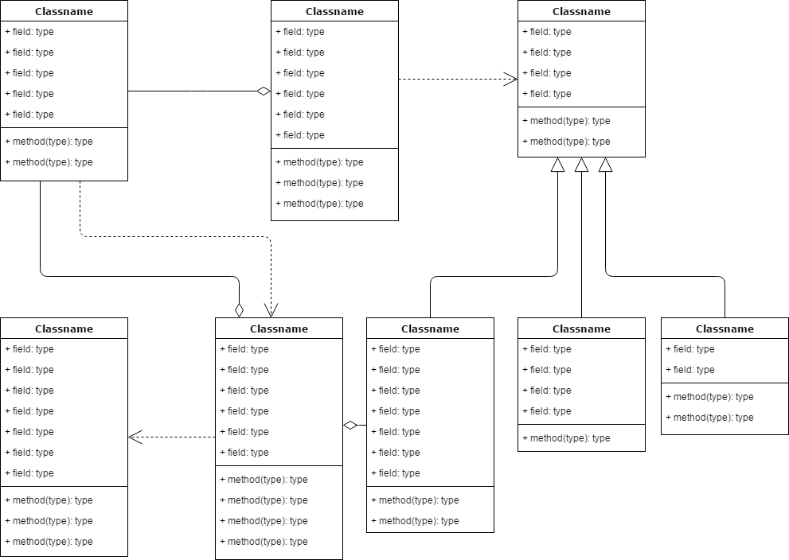

# Detailed Design (详细设计规约)

*(Note: Not all sections are required, just need to select some necessary sections according to your project.)*

## Data Models (数据建模)

### Entity-Relation Design (实体-关系设计)

An Entity-Relation Diagram is required to show the concepts in the project and their relations. And for each entity and realtion, there should be a description after the diagram.

Here gives a sample E-R diagram:


### Database Design (数据库设计)

According to the Entity-Realtion Design, the detailed database design for entities and relations should be listed as tables. Here gives a table template:

**Table: User**

| Column | Type | Description |
|:---:|:---:|:---|
| id | integer | key, identifier |
| name | char[64] | name of the user |


## Interface Specifications （接口规约）

The specifications of interfaces used in interactions among subsystems, here gives a RESTful example in the style of [Swagger](https://swagger.io/):

---
### *customer/name*   

#### Description (接口描述)

Get the name of a customer.

| | |
|-|-|
| Request Method | Get |
| Authorization | Required |


#### Parameters (参数)

| Name | Located in | Description | Required | Schema |
|:-:|:-:|:-|:-:|:-|
| id | query | customer id | Yes | number(double) |

#### Responses (返回结果)

| Code | Description | Schema |
|:----:|:--------|:--|
| 200 | Successful response | *name* : string | 

#### Request Sample (示例请求)

```
customer/name?userId=214
```

#### Response Sample (示例结果)

```
{

  "name" : "Kanglin Yin"

}

```
---


## Process Flow Design （过程流设计）

The sequence diagram is required, to show the whole process of the system from the entry point to the end point, for each user scenario. Here gives a sample: 


## Algorithm Design (算法设计)

In some projects there will be some complicated algorithms. This section is used for the specification of the algorithm including the following information (all of these items are optional) :

- backgroud (surveys or proto-algorithm introduction)
- algorithm framework (flowchart of pseudocde)
- dataset
- dimensions & weight
- key steps

## Class Design (类设计)

For class design, a total class diagram is required. Then each class needs a class description.



Here gives class description sample:

---
### Student

*edu.tongji.entities*

_public class **Student** extends **Human**_

The student instance in the system.

#### Fields

| Modifier and Type | Field | Description |
| :-- | :-- | :-- |
| *public static int* | TYPE_ID | the user type identifier |
| *private int* | id | student id |
| *private string* | name | student name |

#### Constructors

>Student(int id)

Generate the student instance by student's id.

**parameters**
-id: the id of the student

#### Methods

> getId

* public int getId() *

Get the student ID.

**returns**

the student id

**parameters**

none

**throws**

GeneralExpection

> getName

*public String getName()*

*public String getName(int type)*

Get the student name.

**returns**

the student name

**parameters**

-type: 0:full name; 1: first name 2: family name

**throws**

GeneralExpection

--- 