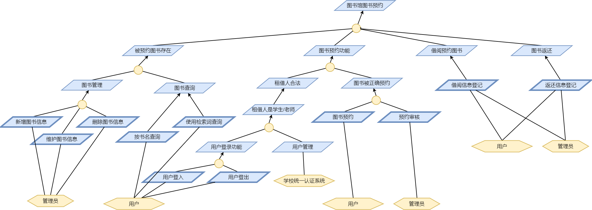
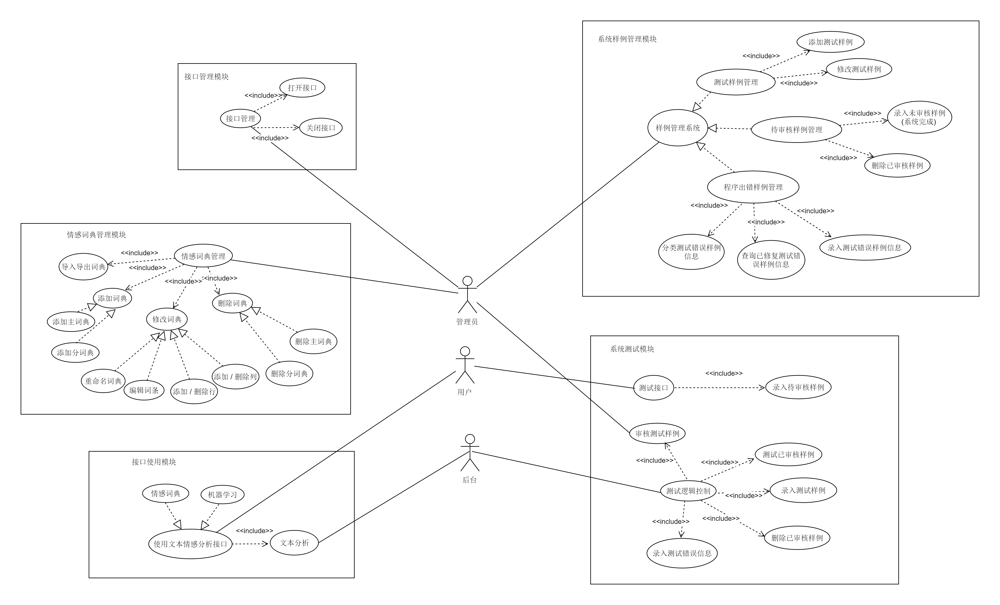
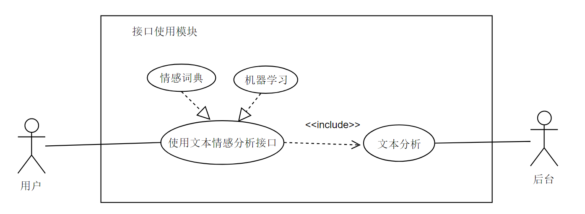
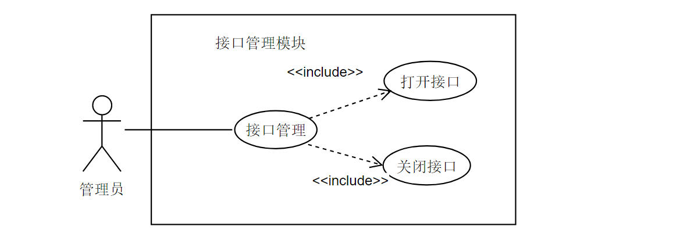
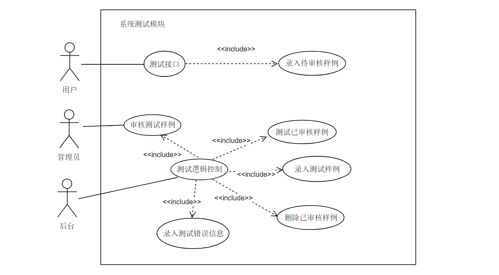
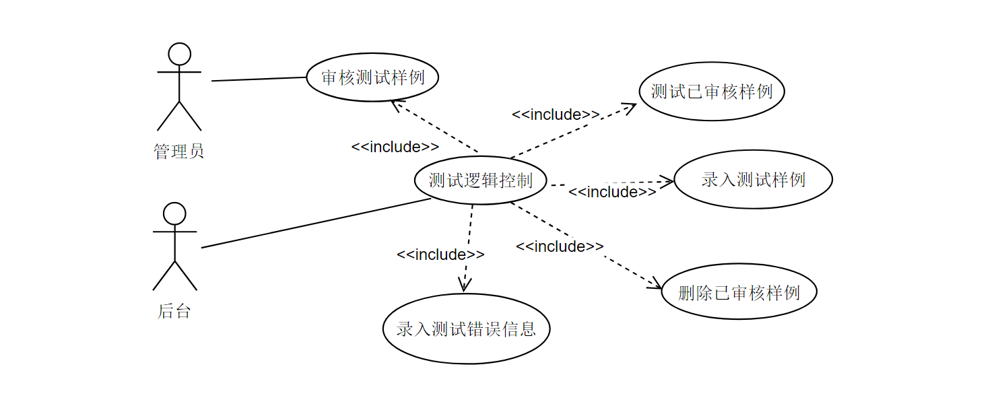
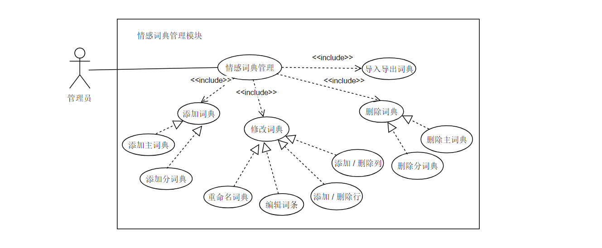
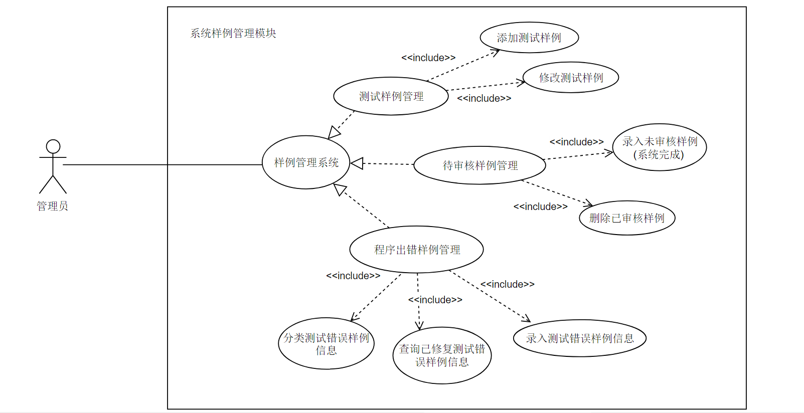

# 需求规约

## 项目介绍

### 项目背景

​      文本情感分析又称意见挖掘， 是对包含用户观点、 喜好、 情感等主观性文本进行挖掘、 分析

及判别它是一个多学科交叉的研究领域， 涉及**概率论**、 **数据统计分析**、 **计算机语言学**、 **自然语言**

**处理**、 **机器学****习**、 **信息检索**、 **本体学** ( Ontology) 等多个学科及其相关技术 。鉴于其在用户

意见挖掘、 垃圾邮件过滤及舆情分析等 多个领域具有重要的应用价值， 文本情感分析正受到国内外

众多研究机构和学者的重视。

​      情感分析可归纳为情感信息抽取、 情感信息分类及情感信息的检索与归纳三项层层递进的研究任 

务 。本文研究的重点是情感信息分类， 旨在将文本情感分为褒义、 贬义两类或者更细致的情感类别。

按照分析文本的粒度不同， 情感信息分类可分为**词语级** 、 **短语级** 、 **句子级** 、 **篇章级** 等几个研究层

次。

​       

​      目前， 情感分类大致涌现出两种研究思路:  **基于情感知识** 和 **基于特征** 。

​      前者主要是基于已有的情感词典或情感知识库 对文本中带有情感或极性的词( 或词语单元) 进行加

权求和， 而后者主要是对文本提取具有类别表征意义的 特征， 再基于这些特征使用机器学习算法进

行分类。

### 项目目标

* 使用 机器学习 和 情感词典 这两种方法 分别对中文新闻类文本进行情感极性分析

* 输入一段新闻文本能够得到文本的情感极性

  ​

### 目标人群

* 需要对已有中文文本数据进行情感分析的企业及用户
* APP中需要集成中文文本情感分析功能的开发人员
* 从事中文文本情感分析与挖掘的研究人员

  ​

### 项目边界

本项目是一个向有中文文本情感分析需求的人员提供接口服务， 并尽可能提高服务质量的APP。

用户可以通过浏览我们的网站来体验我们的中文文本情感分析服务， 并且可以参与到我们的用户

体验改善计划中：通过输入一个已知情感极性的文本及其情感极性来不断训练我们的模型,  同时向

我们后台反馈错误并将错误信息的详细描述插入进我们的数据库中。这样，我们可以不断修复导致

用户反馈的错误的bug，以及使用日益完善的模型来不断提高我们向用户提供的服务质量。此外，

需要在项目中使用中文文本情感分析功能的开发人员可以向我们申请服务接口来进一步使用我们所

提供的服务。 

* #### what we can do 

  * 机器学习方法的接口，接受一个中文文本， 可得到一个正向情感极性的概率和负向情感

    的概率。

  * 基于情感词典的方法的接口， 输入一段中文文本， 可得到文本的情感极性分值 。

  * 可对 篇章级、段落级、句子级 的中文文本进行情感极性判断。

  * 基于情感词典的方法的接口，可以使用不同的情感词典对中文文本进行情感分析。

  * 基于机器学习的方法的接口，可以导入一个训练好的模型来对中文文本进行情感分析。

  * 提供了训练模型和测试准确率的接口， 方便开发者及用户测试我们算法，并汇报错误。

  * 提供了一个数据库用来记录常见的分析用语，以及分析错误的语句，便于开发者完善情感

    分析算法以及修复程序中的bug。

    ​

* #### what we cannot do

  * 无法识别除中文以外的其他语言的文本
  * 无法识别中文文本中的描述对象，无法得出所描述对象的情感极性值
  * 暂时无法对中文文本中蕴含的情感进行分类（喜怒哀乐等）

    ​

## Rquirement Analysis (项目需求分析)

Using a KAOS diagram to decompose the project form high-level goals to user scenarios. Here gives a sample KAOS diagram for a library booking system:

## Use Case Analysis (用例分析)

### 概述

* 本系统有3个参与者, 包括 **用户** , **管理员** , **系统后台** 。其中用户和管理员为主要参与者。 

* 用户为本系统所提供服务的使用者

  * 用户可以直接使用系统所暴露的情感分析接口向后台传递一个中文字符串，从而获得一个文本的正负向情感结果；

  * 用户也可以通过系统所提供的测试接口进行如下操作：

    1. 输入一段已知情感正负向的中文文本并且提供这段文本的正负向情感信息，来进行测试。

    2. 系统会自动的将用户所提供的测试样例的信息插入到“待审核样例数据库” 中， 等待管理员去审核 。

       * 这条测试样例如果通过了管理员的审核：

         1. 这条测试样例会被录入“测试样例数据库” 

         2. 系统会对这条测试样例的文本分别使用情感词典的方法和机器学习的方法来进行情感分析并

            根据所的到的结果进行判断并进行如下操作： 

            * 如果系统使用两种方法计算所得出的结果与测试样例所提供的情感正负值一

              致，则系统不会进行额外的操作。

            * 如果系统只要通过两种方法中的一种计算出的结果与样例所提供的情感正负值不一致，

              那么系统会自动将这条样例插入到“程序出错样例数据库”，以待开发人员找出程序出错的

              原因， 修复其bug， 提高系统所提供服务的质量。

       * 这条样例如果没有通过管理员的审核， 那么系统会自动地将这条错误的测试样例从”待审核测试

         样例数据库“中删除

* 后台为本系统所提供服务的提供者

  * 后台通过接受用户通过网络接口所提供的中文字符串， 来对其进行一系列的算法处理从而得到一个情感

    分析结果， 并将结果返回给用户。

* 管理员为本系统的管理人员。

  * 管理员可以通过接口管理模块，可以开启和关闭系统向用户所提供的服务接口，来进行系统维护，

    和向用户提供中文文本情感极值服务。

  * 管理员也可以通过系统数据库维护模块，来维护系统的关键数据库；

  * 管理员也可以通过情感词典管理模块来对情感词典进行修改等操作

  * 管理员还可以审核用户通过系统所提供的测试接口提交的测试样例，来对系统算法进行测试，不断提高系

    统所提供服务的质量

    ​

-----

### 系统用例全图

​                                                   

​                                                                           图1- 系统用例总图

---

### 详述

​                                                                      图2- 接口使用模块子图

### 父用例: _使用文本情感分析接口_

#### 描述对象

* 使用文本情感分析接口

#### 标识符

* UC00

#### 说明

* 用户使用系统的官方网站上提供的接口输入文本信息, 或使用系统所提供的url接口进行post字符串

​       来获取情感分析结果

#### 参与者

* 用户

#### 频度

* 高

#### 状态

* 通过

#### 前置条件

* 网络连接成功
* 用户访问了我们的网站
* 用户在开发应用中正确的使用了我们所提供的URL, 以正确的方式进行了Http请求

#### 后置条件

* 用户所访问的我们网站的页面上显示了,用户所提交文本的情感的正负向信息
* 用户的目标应用将接受到一个表示其所提交的文本的情感的正负向信息

#### 被扩展的用例

无

#### 被包含的用例

文本分析

#### 可选操作流程

------

### 子用例: _使用情感词典接口_

#### 描述对象

使用情感词典接口

#### 标识符

UC01

#### 说明

* 用户使用系统的官方网站上提供的"使用情感词典方法的文本情感极值分析接口"输入文本信息
* 用户使用系统所提供的"情感词典的文本情感极值分析接口"的URL进行post字符串
* 用户收到所提交的中文字符串在进行情感分析后的结果

#### 参与者

* 用户

#### 频度

* 高

#### 状态

* 通过

#### 前置条件

* 网络连接成功
* 使用访问网站的方式:
  * 用户访问了我们的网站
  * 用户在机器学习栏目的文本输入框内输入了一段中文字符串
* 使用发送Http 请求的方式
  * 用户的网络请求代码里正确使用了我们所提供的URL
  * 用户使用Post方式以我们提供的URL来提交一个中文字符串

#### 后置条件

* 用户所访问的我们网站的页面上显示了,用户所提交文本的情感的正负向信息
* 用户的目标应用将接受到一个表示其所提交的文本的情感的正负向信息

#### 被扩展的用例

无

#### 被包含的用例

文本分析

#### 基本操作流程

* 使用访问网页的方式

  1. 用户打开我们TongjiSentimentAnalysis网站
  2. 用户在网站的情感词典接口栏目相应的文本输出栏内输入所要分析的中文文本

* 使用URL发送Http请求的方式

  1. 在应用程序中添加 网络请求 方面的代码, 使用post的方式向

     http://www.tongji.sentimentanalysis.com 传递一个中文字符串

#### 可选操作流程

* 滚动鼠标滑轮

* 用户可以在情感词典栏目输入需要进行情感分析的中文字符串来获得情感分析结果

  ​

-------

### 子用例: _使用机器学习接口_

#### 描述对象

使用机器学习接口

#### 标识符

UC02

#### 说明

* 用户使用系统的官方网站上提供的"使用机器学习方法的文本情感极值分析接口"输入文本信息
* 用户使用系统所提供的"使用机器学习方法的文本情感极值分析接口"的URL进行post字符串
* 用户收到所提交的中文字符串在进行情感分析后的结果

#### 参与者

* 用户

#### 频度

* 高

#### 状态

* 通过

#### 前置条件

* 网络连接成功
* 使用访问网站的方式:
  * 用户访问了我们的网站
  * 用户在机器学习栏目的文本输入框内输入了一段中文字符串
* 使用发送Http 请求的方式
  * 用户的网络请求代码里正确使用了我们所提供的URL
  * 用户使用Post方式以我们提供的URL来提交一个中文字符串

#### 后置条件

* 用户所访问的我们网站的页面上显示了,用户所提交文本的情感的正负向信息
* 用户的目标应用将接受到一个表示其所提交的文本的情感的正负向信息

#### 被扩展的用例

无

#### 被包含的用例

文本分析

#### 基本操作流程

* 使用访问网页的方式

  1. 用户打开我们TongjiSentimentAnalysis网站
  2. 用户在网站的机器学习接口栏目相应的文本输出栏内输入所要分析的中文文本

* 使用URL发送Http请求的方式

  1. 在应用程序中添加 网络请求 方面的代码, 使用post的方式向

     http://www.tongji.sentimentanalysis.com 传递一个中文字符串

#### 可选操作流程

* 滚动鼠标滑轮
* 用户可以在情感词典栏目输入需要进行情感分析的中文字符串来获得情感分析结果

----

### 被包含用例: _文本分析_

#### 描述对象

* 文本分析

#### 标识符

* UC03

#### 说明

* 系统通过解析用户所发送的网络请求包, 进行一系列判断, 最终采取用户所需要的方案

  对用户提交的文本进行情感分析, 并将情感分析结果返回给用户。

#### 参与者

* 系统后台

#### 频度

* 高

#### 状态

* 通过

#### 前置条件

* 系统有收到来自用户的网络请求包

#### 后置条件

* 系统将文本的情感分析结果返回给用户

#### 被扩展的用例

无

#### 被包含的用例

无

#### 基本操作流程

1. 解析网络请求信息, 获取请求体中的中文文本和其他信息

2. 根据网络请求信息, 判断用户欲使用机器学习接口还是情感词典方法接口

   * 如果是机器学习接口, 那么系统会使用机器学习算法, 对解析请求体所得到的中文文

     本进行情感分析

   * 如果是情感词典方法接口, 那么系统会根据请求体中的词典选择信息来选择一个词典, 

     使用情感词典的方法来进行情感分析

3. 将计算所得到的结果发送给用户

#### 可选操作流程

* 无

------

​                                                                         图3- 接口管理模块子图

### 主用例: _接口管理_

#### 描述对象

* 接口管理

#### 标识符

* UC04

#### 说明

* 管理员通过接口管理用例,  控制系统向外界暴露的网络服务接口的开放或者关闭
* 管理员通过开启接口以向外界提供情感分析服务
* 管理员通过关闭接口以进行系统维护

#### 参与者

* 管理员

#### 频度

* 低

#### 状态

* 通过

#### 前置条件

* 管理员登入管理系统
* 管理员进入接口管理页面

#### 后置条件

* 系统向外界提供的中文文本情感分析网络接口的状态发生变化

#### 被扩展的用例

* 无

#### 被包含的用例

* 打开接口
* 关闭接口

#### 基本操作流程

1. 管理员登入管理系统， 进入服务接口管理页面
2. 通过选择相应接口的开关状态， 从而控制接口的开放或者关闭

#### 可选操作流程

* 无

______

### 被包含用例: _打开接口_

#### 描述对象

* 打开接口

#### 标识符

* UC05

#### 说明

* 管理员通过打开接口用例开启系统向外界提供的文本情感分析网络接口。
* 管理员通过开启情感分析服务接口，从而使外界可以使用系统提供的情感分析服务。

#### 参与者

* 管理员

#### 频度

* 低

#### 状态

* 通过

#### 前置条件

* 管理员登入了管理系统
* 管理员进入了接口管理页面
* 将开启的服务接口的状态为关闭

#### 后置条件

* 一个或多个情感分析服务接口被开启

#### 被扩展的用例

* 无

#### 被包含的用例
* 无

#### 基本操作流程

1. 管理员登入管理系统， 并进入接口管理页面

2. 管理员选择以下一至多个接口：

   * 情感词典文本分析方法的接口
   * 机器学习文本分析方法的接口
   * 系统测试文本分析方法的接口

   的状况台为开启， 并点击提交按钮， 从而开启被选文本情感分析服务接口。

#### 可选操作流程

* 管理员在选择服务接口的状态为开启后， 可以在确认框内点击取消按钮来取消开启接口的动作。

_____

### 被包含用例: _关闭接口_

#### 描述对象

* 关闭接口

#### 标识符

* UC06

#### 说明

* 管理员通过关闭接口用例， 关闭系统向外界暴露的情感分析服务接口。
* 管理员通过关闭系统提供的服务接口， 以方便开发人员对整个系统进行维护。

#### 参与者

* 系统后台

#### 频度

* 低

#### 状态

* 通过

#### 前置条件

* 管理员登入了管理系统。
* 管理员进入了接口管理页面。
* 将关闭的服务接口的状态为开启。

#### 后置条件

* 系统提供给外界的一至多个文本情感分析接口被关闭

#### 被扩展的用例

* 无

#### 被包含的用例

* 无

#### 基本操作流程

1. 管理员进入管理系统的接口管理页面

2. 管理员选择以下一至多个接口：

   * 情感词典文本分析方法的接口
   * 机器学习文本分析方法的接口
   * 系统测试文本分析方法的接口

   的状态为关闭， 并确认， 从而关闭以上一至多个接口。

#### 可选操作流程

* 管理员在选择服务接口的状态为关闭后， 可以在确认框内点击取消按钮来取消关闭接口的动作。

--------

​                                                                       图 4  -  系统测试模块子图

​                                                              图 5 -  系统测试模块  -  测试接口用例

### 用例: _测试接口_

#### 描述对象

* 测试接口

#### 标识符

* UC07

#### 说明

* 用户访问系统提供的网站, 使用测试接口,  通过提交一个测试样例， 来对系统所提供的服务进行测试，以便于

  开发人员发现系统算法的漏洞， 并升级系统提供的服务质量。

#### 参与者

* 用户

#### 频度

* 高

#### 状态

* 通过

#### 前置条件

* 用户进入了系统提供的网站。

#### 后置条件

* 系统将反馈一个测试结果：

  * 若用户提交的测试样例通过了系统管理员审核， 并且系统在使用这条测试样例进行测试是出现了错误

    则， 用户的页面将被刷新， 并且通知用户提交一个很有价值的测试用例。

  * 若用户提交的测试样例没有通过系统管理员审核， 用户的界面将被刷新， 并且通知用户提交的样例没有

    通过审核。

#### 被扩展的用例

* 无

#### 被包含的用例

* 录入待审核测试样例

#### 基本操作流程

1. 用户访问系统提供的官方网站, 并滑动滚轮至测试栏目
2. 用户在测试栏目的文本输入框内输入一段已知情感极性的中文文本, 勾选所提供文本的情感极性为正或者负
3. 点击提交按钮, 则用户所提交的中文文本,及所选择的情感极性则会被作为一个测试样例发送给系统后台.

#### 可选操作流程

* 用户在点击提交按钮前可以修改:
  * 文本输入框内的中文文本
  * 情感极值选项框的选择情况
* 用户可以滑动滚轮至其他栏目

--------

### 被包含用例: _录入待审核样例_

#### 描述对象

* 录入待审核样例

#### 标识符

* UC08

#### 说明

* 系统接受到用户提交的测试样例, 并将这条测试样例标记为待审核样例, 并将其录入到待审核样例数据库。

#### 参与者

* 系统后台

#### 频度

* 中

#### 状态

* 通过

#### 前置条件

* 系统收到用户提交的测试样例。

#### 后置条件

* 测试样例逻辑控制模块被告知收到了一条新的测试样例。

#### 被扩展的用例

* 无

#### 被包含的用例

* 无

#### 基本操作流程

1. 系统收到用户提交的测试样例。
2. 系统将用户提交的测试样例标记为待审核样例。
3. 系统将这条待审核样例录入到待审核样例数据库。
4. 系统告知测试样例逻辑控制模块收到了一条新的测试样例。

#### 可选操作流程

* 无

-----

​                                                        图 5  -   系统测试模块 - 测试逻辑控制用例      

### 主用例: _测试逻辑控制_

#### 描述对象

* 测试逻辑控制

#### 标识符

* UC09

#### 说明

* 系统测试样例逻辑控制模块被告知系统接受到一条新的测试样例后, 通过控制被标志的测试样例在系统内的流动方向, 及系统对其的处理, 来完成整个测试流程。

#### 参与者

* 系统后台

#### 频度

* 中

#### 状态

* 通过

#### 前置条件

* 样例测试逻辑控制模块被告知接受到一个新的测试样例。

#### 后置条件

* 系统运行样例测试流程。

#### 被扩展的用例

* 无

#### 被包含的用例

* 审核测试样例
* 录入测试样例
* 删除已审核样例
* 文本分析
* 录入测试错误信息

#### 基本操作流程

1. 样例测试逻辑控制模块被告知接受到一个新的测试样例。

2. 系统通知管理员审核被标记的测试样例。

3. 管理员审核这条被标记的测试样例后, 告知系统已审核。

4. 系统在将这条测试样例从待审核样例数据库中删除

5. 系统根据管理员的审核结果进行以下操作:

   * 管理员认定测试样例无效:

     * 系统通过用户所访问的系统网站网页通知用户 :  测试样例没有通过审核 

   * 管理员认定测试样例有效:

     * 系统分别使用机器学习和情感词典这两种方法, 对样例文本分别进行情感分析

       得出分析结果, 进行以下判断、操作：

       1. 如果两种方法的测试结果与样例给出的结果一致,  则系统通知用户 :  

          该测试样例没有发现系统的漏洞.

       2. 如果使用两种方法的测试结果有一方与样例给出的结果不一致, 则系统通知用户:

          该测试样例发现了系统的漏洞.

#### 可选操作流程

* 无

--------------------

### 被包含用例: _审核测试样例_

#### 描述对象

* 审核测试样例

#### 标识符

* UC10

#### 说明

* 管理员审核系统通知的待审核测试样例, 然后告知系统该测试样例已审核, 并返回审核结果 。

#### 参与者

* 管理员

#### 频度

* 中

#### 状态

* 通过

#### 前置条件

* 管理员收到了系统的待审核通知
* 管理员有意愿审核

#### 后置条件

* 系统将受到管理员的审核结果

#### 被扩展的用例

* 无

#### 被包含的用例

* 无

#### 基本操作流程

1. 管理员登陆管理系统的审核页面。
2. 管理员对测试样例审核页面上的样例的文本和给出的结果进行审核。
3. 管理员在每条待审核样例条目上选择 有效 / 无效 。
4. 管理员点击页面的提交按钮。
5. 管理员在弹出的确认栏点击确认按钮完成本次确认。
6. 审核页面刷新。

#### 可选操作流程

* 管理员点击提交按钮后, 可以在弹出的确认框中点击取消按钮来取消本次审核操作。

------

### 被包含用例:  _录入测试样例_

#### 描述对象

* 录入测试样例

#### 标识符

* UC11

#### 说明

* 系统收到了管理员的审核结果,  将管理员认定有效的测试样例录入测试样例数据库。

#### 参与者

* 系统后台

#### 频度

* 中

#### 状态

* 通过

#### 前置条件

* 系统收到了管理员的审核结果。

#### 后置条件

* 系统将文本的情感分析结果返回给用户

#### 被扩展的用例

* 无

#### 被包含的用例

* 无

#### 基本操作流程

1. 系统收到管理员的审核结果。
2. 系统将管理员认定有效的测试样例信息插入进测试样例数据库。

#### 可选操作流程

* 无

---

### 被包含用例:   _删除已审核样例_

#### 描述对象

* 删除已审核样例

#### 标识符

* UC12

#### 说明

* 系统收到了管理员的审核结果, 将结果中给出的所有已审核的测试样例从待审核测试样例数据中删除。

#### 参与者

* 系统后台

#### 频度

* 中

#### 状态

* 通过

#### 前置条件

* 系统收到了管理员的审核结果。

#### 后置条件

* 待审核样例数据库被更新。

#### 被扩展的用例

* 无

#### 被包含的用例

* 无

#### 基本操作流程

1. 系统接收到管理员的审核结果
2. 系统将管理员本次审核的所有测试样例从待审核测试样例数据库中删除。

#### 可选操作流程

* 无

----

### 被包含用例:  _测试已审核样例_

#### 描述对象

* 测试已审核样例

#### 标识符

* UC13

#### 说明

* 系统收到了管理员的审核结果, 并把管理员认定有效的每一条测试样例分别使用基于机器学习的方法和基于情

  感词典的方法进行情感分析,  并将将结果返回至样例测试逻辑控制模块。

#### 参与者

* 系统后台

#### 频度

* 中

#### 状态

* 通过

#### 前置条件

* 系统收到了管理员对待审核测试样例的审核结果。

#### 后置条件

* 样例测试逻辑控制模块将接受到样例的测试结果

#### 被扩展的用例

* 无

#### 被包含的用例

* 无

#### 基本操作流程

* 系统收到管理员的审核结果。
* 系统对每一条测试样例使用情感词典和机器学习这两种方法进行情感分析。
* 系统将每一条测试样例的测试结果反馈给样例测试逻辑控制模块。

#### 可选操作流程

* 无

----

### 被包含用例:  _录入测试错误信息_

#### 描述对象

* 录入测试错误信息

#### 标识符

* UC13

#### 说明

* 系统收到的每一条测试样例的测试结果在逻辑控制模块进行分析后， 将导致系统情感分析出错的样例信息，

  以及系统对该样例进行情感分析过程中的中间信息录入程序出错样例数据库中。

#### 参与者

* 系统后台

#### 频度

* 中

#### 状态

* 通过

#### 前置条件

* 文本分析模块将每一条测试样例的结果传递给样例测试逻辑控制模块。

#### 后置条件

* 程序出错样例数据库将更新。

#### 被扩展的用例

* 无

#### 被包含的用例

* 无

#### 基本操作流程

1. 测试逻辑控制模块收到文本分析模块对样例的测试结果及中间信息。

2. 测试逻辑控制模块对测试结果与正确结果不一致的测试样例以及系统对该样例进行测试时生成的中间信息

   传递给程序出错样例数据库管理模块。

3. 程序出错样例数据库管理模块将该测试样例，以及中间信息录入其所管理的数据库中。

#### 可选操作流程

* 无

-----

​                                                                 图 6 - 情感词典管理模块

### 主用例:  _情感词典管理_

#### 描述对象

* 情感词典管理

#### 标识符

* UC14

#### 说明

* 管理员通过情感词典管理用例对系统内部的情感词典进行调整， 从而改变系统所提供的基于词典的情感分析

  的接口服务的服务质量。

#### 参与者

* 管理员

#### 频度

* 中

#### 状态

* 通过

#### 前置条件

* 管理员登入情感词典管理页面

#### 后置条件

* 情感词典得到调整。

#### 被扩展的用例

* 无

#### 被包含的用例

* 添加词典

* 删除词典
* 修改词典
* 导入导出词典

#### 基本操作流程

1. 管理员登入情感词典管理页面。
2. 管理员在该页面的不同栏目进行系统所提供的可选操作。
3. 管理员在页面点击提交按钮。
4. 管理员在确认框内点击确认按钮。
5. 系统执行管理员的提交的操作命令。

#### 可选操作流程

* 管理员可以在提交前可以修改操作
* 管理员可以点击确认框的取消按钮取消本次操作

-------

### 被包含用例:  _修改词典_

#### 描述对象

* 修改词典

#### 标识符

* UC15

#### 说明

* 管理员登入管理系统, 点击系统上方情感词典管理标签, 进入 情感词典管理页面
* 管理员在情感词典管理页面进行情感词典的修改工作。

#### 参与者

* 管理员

#### 频度

* 中

#### 状态

* 通过

#### 前置条件

* 管理员登入了系统的词典管理界面。

#### 后置条件

* 管理员选择进行修改的词典的内容将被修改。

#### 被扩展的用例

* 无

#### 被包含的用例

* 无

#### 被继承的用例

* 编辑词条
* 添加行 / 列
* 重命名词典

#### 基本操作流程

1. 管理员登入系统的词典管理界面。
2. 管理员点击系统上方 "情感词典管理" 标签页
3. 管理员在左侧的情感词典列举栏选择一个需要修改的主词典
4. 页面中心显示了管理员选择的主词典的第一个分词典的信息
5. 管理员在右侧的分词典列举栏中选择一个需要编辑的分词典
6. 管理员可以选择
   * 编辑分词典的词条
   * 编辑分词典的列
   * 添加 / 删除词条
   * 重命名 主词典/ 分词典
7. 管理员点击系统的提交按钮, 在确认框中点击确认, 即可完成对情感词典的修改。

#### 可选操作流程

* 管理员在提交修改之后可以在确认框中点击取消, 来取消本次修改。

----

### 被包含用例:  _添加词典_

#### 描述对象

* 添加词典

#### 标识符

* UC16

#### 说明

* 管理员登入管理系统, 点击系统上方情感词典管理标签, 进入 情感词典管理页面
* 管理员可以在情感词典管理页面添加主词典 / 分词典

#### 参与者

* 管理员

#### 频度

* 低

#### 状态

* 通过

#### 前置条件

* 管理员进入了情感词典管理页面

#### 后置条件

* 系统后台将创建新的情感词典, 以数据库表示

#### 被扩展的用例

* 无

#### 被包含的用例

* 无

#### 被继承的用例

* 添加主词典
* 添加分词典

#### 基本操作流程

* 管理员登入系统的词典管理界面。

* 管理员点击系统上方 "情感词典管理" 标签页

* 管理员在系统左侧栏选择一个主词典, 在右侧栏点击添加分词典按钮即可创建一个分词典

* 管理员在系统左侧栏中点击创建主词典, 即可创建一个主词典

  ( 注: 一个主词典由一到多个分词典组成 )

* 管理员点击系统的提交按钮, 在确认框中点击确认, 即可完成对情感词典的添加。

#### 可选操作流程

* 管理员在提交修改之后可以在确认框中点击取消, 来取消本次添加操作。

------

### 被包含用例:  _删除词典_

#### 描述对象

* 情感词典管理

#### 标识符

* UC17

#### 说明

* 管理员登入管理系统, 点击系统上方情感词典管理标签, 进入 情感词典管理页面
* 管理员在情感词典管理页面进行情感词典的修改工作。

#### 参与者

* 管理员

#### 频度

* 低

#### 状态

* 通过

#### 前置条件

* 管理员进入了情感词典管理页面

#### 后置条件

* 系统的一到多个情感词典将会被删除

#### 被扩展的用例

* 无

#### 被包含的用例

* 无

#### 被继承的用例

* 删除分词典
* 删除主词典

#### 基本操作流程

* 管理员登入系统的词典管理界面。
* 管理员点击系统上方 "情感词典管理" 标签页
* 管理员点击界面左侧栏中列举的主词典条目中右侧的删除按钮
* 或
* 管理员点击界面右侧栏中列举的分词典条目下方的删除按钮
* 管理员点击系统的提交按钮, 在确认框中点击确认, 即可完成对情感词典的删除

#### 可选操作流程

* 管理员在提交修改之后可以在确认框中点击取消, 来取消本次删除操作。

----

### 被包含用例:  _导入导出词典_ 

#### 描述对象

* 导入导出词典

#### 标识符

* UC18

#### 说明

* 管理员在情感词典管理页面, 可以选择主词典 或 分词典 进行词典的导出工作
* 管理员可以新建一个主词典, 然后将主词典的分词典全部导入, 可以完成词典的导入工作

#### 参与者

* 管理员

#### 频度

* 低

#### 状态

* 通过

#### 前置条件

* 管理员进入了情感词典管理页面

#### 后置条件

* 一至多个情感词典将被导入进系统

#### 被扩展的用例

* 无

#### 被包含的用例

* 无

#### 基本操作流程

* 管理员进入情感词典管理页面

* 导入: 

  1. 管理员选择一个需要导入分词典的主词典
  2. 管理员点击导入按钮, 选择一个词典本地文件
  3. 管理员点击提交按钮, 并确定, 即可完成词典的导入工作

* 导出: 

  1. 管理员选择一个需要导出的主词典 或 分词典
  2. 管理员点击导出按钮, 键入文件名
  3. 管理员点击提交按钮, 并确定, 即可完成词典的导出工作。

  ​

#### 可选操作流程

* 无

--------

​                                                               

​                                                                        图 7 - 系统样例管理模块

### 父用例:  _样例管理_ 

#### 描述对象

* 样例管理

#### 标识符

* UC18

#### 说明

* 管理员通过样例管理用例可以对系统的样例进行管理
* 系统的样例分为:
  * 测试样例
  * 待审核样例
  * 程序出错样例

#### 参与者

* 管理员

#### 频度

* 高

#### 状态

* 通过

#### 前置条件

* 管理员管理员进入了系统页面

#### 后置条件

* 系统样例得到了管理

#### 被扩展的用例

* 无

#### 被包含的用例

* 无

#### 被继承的用例

* 测试样例管理
* 待审核样例管理
* 程序出错样例管理

#### 基本操作流程

* 管理员进入系统管理页面
* 管理员在页面选择一个样例管理页面并进入
* 管理员根据页面所暴露的功能操作交互接口进行一系列操作
* 管理人点击页面的提交按钮, 并确认操作

#### 可选操作流程

* 管理员在提交后可以点击取消按钮来取消操作

----

### 子用例:  _测试样例管理_ 

#### 描述对象

* 测试样例管理

#### 标识符

* UC18

#### 说明

* 管理员在测试样例管理界面可以对系统的所有测试样例进行管理

#### 参与者

* 管理员

#### 频度

* 中

#### 状态

* 通过

#### 前置条件

* 管理员进入了测试样例管理页面

#### 后置条件

* 系统的测试样例得到了管理

#### 被扩展的用例

* 无

#### 被包含的用例

* 添加测试样例
* 修改测试样例

#### 基本操作流程

* 管理员进入测试样例管理界面

* 添加测试样例:

  * 管理员点击界面的添加样例按钮
  * 管理员在界面弹出的样例填写框内填写新增的样例的信息
  * 管理员点击提交即可添加一条的新的测试样例

* 浏览测试样例:

  * 界面中央的表格中显示了系统所有的测试样例
  * 管理员可以通过点击上下页按钮或通过输入需要浏览的页数来进行浏览

* 查询测试样例:

  * 页面测试样例默认是以ID的升序来安排的测试样例

  * 管理员在输入栏中输入ID, 或测试样例的文本, 或测试样例的情感极值, 或是否经过测试

    来搜索测试样例

* 编辑测试样例:

  * 管理员可以对未测试的样例进行编辑工作
  * 管理员点击未测试样例条目中的文本栏及文本极值栏的信息来编辑未测试样例的信息

* 删除测试样例:

  * 管理员可以对未测试的样例进行删除工作

* 管理员在进行样例操作后点击系统的提交按钮并点击确认已完成操作

  ​

#### 可选操作流程

* 管理员可以在点击提交按钮前继续对测试样例进行管理

----

### 子用例:  _待审核样例管理_ 

#### 描述对象

* 待审核样例管理

#### 标识符

* UC18

#### 说明

* 管理员进入待审核样例管理页面可以对待审核样例进行审核操作

#### 参与者

* 管理员 

#### 频度

* 高

#### 状态

* 通过

#### 前置条件

* 管理员进入了系统的待审核样例管理页面
* 用户提交了新的测试样例

#### 后置条件

* 用户提交的测试样例将被管理员进行审核

#### 被扩展的用例

* 无

#### 被包含的用例

* 删除已审核测试样例
* 录入未审核测试样例

#### 基本操作流程

* 管理员进入待审核测试样例管理页面
* 页面中央的表格中显示了所有用户提交的未审核的测试样例, 每条样例可以选择有效或者无效
* 管理员选择一至多条待审核样例有效或无效
* 管理员点击提交按钮即可提交审核

#### 可选操作流程

* 管理员在点击提交按钮前可以修改审核

---

### 子用例:  _程序出错样例管理_ 

#### 描述对象

* 程序出错样例管理

#### 标识符

* UC18

#### 说明

* 管理员进入程序出错样例管理页面,  对程序出错样例进行查看, 审核, 管理

#### 参与者

* 管理员

#### 频度

* 高

#### 状态

* 通过

#### 前置条件

* 管理员进入了程序出错样例管理页面

#### 后置条件

* 程序出错样例将得到审核分类,管理

#### 被扩展的用例

* 无

#### 被包含的用例

* 新建、删除、修改程序出错样例分组
* 分组程序出错样例
* 查询程序出错样例
* 修改程序出错样例

#### 基本操作流程

* 管理员进入程序出错样例管理页面
* 界面中央显示了已有的程序出错样例
* 修改程序出错样例：
  * 管理员点击样例条目可以标记样例错误是否被修复
  * 管理员点击页面的相应的分组按钮可以添加删除修改错误原因分组
  * 管理员点击样例条目的分组按钮可以按照错误原因对样例分组
* 查询错误样例：
  * 管理员可以按照ID， 样例文本， 情感极值对样例进行检索
  * 管理员可以点击界面显示的分组标签来控制页面显示哪一组的程序错误样例、
* 管理员点击页面的提交按钮， 并确认即可提交操作

#### 可选操作流程

* 管理员可以点击取消按钮取消操作